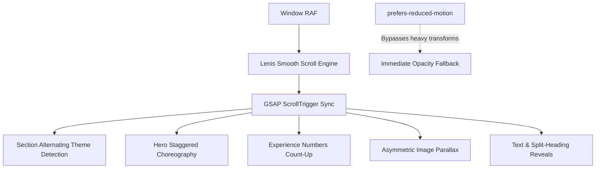

# RK Visual Photography — V2 Visual & UX Revamp Architecture Plan
**Target Website**: [https://rk-visual-photography.vercel.app/](https://rk-visual-photography.vercel.app/)  
**Document Version**: 2.0.0  
**Phase**: V2-01 Visual Foundation & Architecture

---

## 1. Executive Summary & Design Vision

RK Visual Photography is an existing, fully-deployed, production-grade Next.js 15 App Router website backed by Supabase PostgreSQL and ImageKit CDN. The website currently houses complete CMS-managed galleries, projects, categories, services, testimonials, social reels, an inquiry flow, and a database-driven FAQ assistant.

### 1.1 The Core Problem in V1
While functionally robust and performant, the V1 user interface suffered from:
1. **Monolithic Dark Palette**: Every section was uniformly dark charcoal/black (`#0B0C0E`), causing visual fatigue and diminishing the natural warmth of South Indian wedding celebrations.
2. **Photography Under-Utilization**: The real studio imagery available in `public/assets/images` was under-leveraged in favor of generic placeholders.
3. **Hero Experience Restraint**: The hero relied on a single aperture element rather than an immersive, multi-layered cinematic choreography.
4. **Missing Proof of Experience**: Key studio milestones and operational longevity metrics (years in media, weddings captured, events managed, happy couples) were absent from the narrative flow.
5. **Static Rhythm**: Scroll interaction lacked asymmetric pacing, editorial section transitions, and responsive mobile conversion triggers.

### 1.2 The V2 Philosophy: Warm Luxury Editorial
Inspired by the rhythmic pacing of editorial luxury houses (such as *Devcutz* and *Jaihindh Photography*), V2 introduces:
- **Alternating Section Rhythm**: Dark → Light (Ivory) → Dark → Warm Champagne → Dark → Ivory → Dark.
- **Hero Staggered Choreography**: Multi-layer authentic studio photographs, Ken Burns drift, dynamic scale, and the signature RK Monogram Mask aperture.
- **Authentic Asset Primacy**: 100% real studio photographs from Tamil Nadu (Pappakudi, Chennai, Madurai) showcasing authentic Kanchipuram silks, muhurtham moments, and golden-hour couple sessions.
- **Lenis + GSAP Scroll Storytelling**: Frictionless inertial scrolling paired with GSAP ScrollTrigger for asymmetric reveals, counters, and parallax.

---

## 2. Current Architecture & Preserved Systems

> [!IMPORTANT]
> **Zero-Disruption Invariant**: The following foundational systems are functional, verified live in production, and **MUST NOT BE REWRITTEN OR DELETED**:

| Subsystem | Tech Stack | Status & Role |
| :--- | :--- | :--- |
| **Framework** | Next.js 15.5 App Router + React 19 + TypeScript | Server Components default, Client Components at leaves. |
| **Database & Auth** | Supabase PostgreSQL + Row Level Security (RLS) | 15 active tables; session management; admin authentication. |
| **CDN & Image Delivery** | ImageKit.io API + Next.js Image Optimization | Dynamic responsive sizing, webp/avif conversion, zero DB bloat. |
| **Inquiry CMS** | Server Actions + Zod Validation + Supabase Storage | Public multi-step inquiry form + Admin Kanban/table dashboard. |
| **Chatbot Assistant** | Hybrid CMS-driven rule engine (`RKAssistant.tsx`) | Category navigation, FAQ search, instant WhatsApp/call handoff. |
| **Social Media CMS** | Instagram Graph API / Embeds + YouTube Shorts | Featured reels, fallback cards, admin publishing control. |
| **Motion Engine** | GSAP 3.12 + ScrollTrigger + Lenis 1.1 + Framer Motion | Smooth scroll synchronization with `prefers-reduced-motion` safety. |

---

## 3. Visual System & Design Tokens (V2)

### 3.1 Color Palette Matrix

```
┌────────────────────────────────────────────────────────────────────────┐
│ DEEP CHARCOAL        SOFT BLACK           WARM IVORY        CHAMPAGNE  │
│    #141414            #1D1D1B              #F4F0E8           #E7DDCA   │
│  (Dark Canvas)     (Dark Elevated)      (Light Surface)    (Warm Accent)│
├────────────────────────────────────────────────────────────────────────┤
│ MUTED ANTIQUE GOLD    WARM TAUPE         IVORY BORDER       IVORY TEXT │
│    #B88A3B             #8D806D             #DDD5C5           #1C1B19   │
│ (Luxury Metal)      (Neutral Text)      (Light Divider)   (Light Head) │
└────────────────────────────────────────────────────────────────────────┘
```

### 3.2 Alternating Section Rhythm Blueprint

The homepage and long-form pages alternate between dark and light canvases to create visual breathing room:

```
[01. HERO / INTRO]               ──► DARK (#141414)
       ↓ (Hairline Gold Divider)
[02. EXPERIENCE METRICS]          ──► WARM IVORY (#F4F0E8)
       ↓ (Asymmetric Reveal)
[03. FEATURED WORK]              ──► DARK (#141414)
       ↓ (Warm Taupe Transition)
[04. BRAND MANIFESTO & STORY]    ──► LIGHT / CHAMPAGNE (#E7DDCA)
       ↓
[05. BESPOKE SERVICES]           ──► DARK (#141414)
       ↓
[06. CLIENT EXPERIENCE JOURNEY]  ──► WARM IVORY (#F4F0E8)
       ↓
[07. SOCIAL & REELS CINEMA]      ──► DARK (#141414)
       ↓
[08. WORDS OF TRUST (REVIEWS)]   ──► WARM IVORY (#F4F0E8)
       ↓
[09. FINAL INQUIRY INVITATION]   ──► DARK LUXURY (#141414)
       ↓
[10. FOOTER]                     ──► SOFT BLACK (#1D1D1B)
```

---

## 4. Studio Photography Asset Strategy

The repository contains 11 authentic photographs from the studio in `public/assets/images`. These real photographs supersede all external stock imagery across the visual hierarchy:

```
public/assets/images/
├── image.png    ──► Golden Hour Couple Silhouette with Sun (Cinematic Hero Lead)
├── image1.png   ──► Adorable Outdoor Child Portrait on Car Hood (Kids & Family)
├── image2.png   ──► Smiling Toddler on Tricycle (Candid Joy / Portrait)
├── image3.png   ──► Twilight Meadow Baby Girl in Velvet Gown (Baby & Portraits)
├── image4.png   ──► South Indian Ceremony with Heritage Gold Jewelry (Traditional Portraits)
├── image5.png   ──► Royal Blue Silk Wedding Reception Couple (Evening Weddings)
├── image6.png   ──► Kanchipuram Silk Bridal Preparation & Floral Wall (Fine-Art Wedding)
├── image7.png   ──► Royal Enfield Bullet Highway Sunset Couple (Pre-Wedding Journey)
├── image8.png   ──► Stage Proposal under Chandelier (Luxury Wedding Moments)
├── image9.png   ──► Windy Beach Sunset with Billowing Crimson Gown (Cinematic Pre-Wedding)
└── image10.png  ──► Traditional Lake Boat Ride Couple Portrait (Heritage Romance)
```

### 4.1 Asset Placement Mapping

| Component / Section | Primary Real Image | Supporting Real Image | Emotional Tone |
| :--- | :--- | :--- | :--- |
| **Cinematic Hero Multi-Layer** | `image.png` (Sun Silhouette) | `image9.png` (Crimson Gown), `image6.png` (Bride) | Timeless, evocative, cinematic |
| **RK Monogram Aperture** | `image8.png` (Chandelier Proposal) | `image6.png` (Bridal details) | Royal, sacred, heirloom |
| **Featured Story 01** | `image8.png` (Royal Stage Moment) | `image5.png` (Reception Couple) | Opulence & celebration |
| **Featured Story 02** | `image9.png` (Windy Beach Sunset) | `image7.png` (Bullet Sunset Ride) | Youthful romance & journey |
| **Featured Story 03** | `image10.png` (Lake Boat Romance) | `image4.png` (Temple Jewelry) | South Indian cultural heritage |
| **Behind the Lens / About** | `image4.png` & `image6.png` | Studio lead portrait | Fine-art craftsmanship |
| **Portraits & Families** | `image1.png`, `image2.png`, `image3.png` | Gallery carousels | Life milestones & warmth |

---

## 5. Component Inventory & Action Matrix

### 5.1 Existing Components to Retain Without Breaking
- `components/motion/SmoothScrollProvider.tsx` — Lenis + GSAP RAF loop
- `components/gallery/ImageLightbox.tsx` — Fullscreen high-resolution lightbox
- `components/gallery/ProjectGalleryGrid.tsx` — Masonry layout with ImageKit delivery
- `components/chatbot/RKAssistant.tsx` — Floating interactive FAQ assistant
- `components/chatbot/assistant-engine.ts` — Intelligent category search algorithm
- `components/admin/*` — Full studio CMS dashboard (Projects, Galleries, Inquiries, etc.)
- `lib/supabase/*` — Resilient production database client & queries

### 5.2 Components to Enhance / Modify in V2
- `tailwind.config.ts` — Inject V2 color tokens (`charcoal`, `soft-black`, `ivory`, `champagne`, `gold`, `taupe`) and responsive typography.
- `app/globals.css` — Add `.section-theme-dark` and `.section-theme-ivory` classes, hairline borders, and focus rings.
- `components/ui/Button.tsx` — Add `ivory` and `dark` variants for contextual contrast across alternating sections.
- `components/ui/Container.tsx` — Add theme-aware background/text propagation.
- `components/ui/SectionHeading.tsx` — Support dual-theme (`theme="dark" | "light"`) styling.
- `components/hero/RKHeroMask.tsx` — Upgrade into a multi-layered cinematic compositor with real studio photos.
- `components/navigation/Navbar.tsx` — Ensure dynamic contrast when scrolling over light vs dark sections.

### 5.3 Components to Create in Subsequent V2 Phases
1. `components/sections/ExperienceMetrics.tsx` — Animated count-up metrics (10+ Years, 500+ Weddings, 250+ Events, 1000+ Happy Couples) backed by Supabase `site_settings`.
2. `components/sections/EditorialMarquee.tsx` — Infinite seamless horizontal ticker with typography separators.
3. `components/sections/ExperienceJourney.tsx` — 6-step couple client experience journey (Discover → Consult → Plan → Capture → Craft → Deliver).
4. `components/sections/BeforeAfterSlider.tsx` — Interactive split-screen slider demonstrating raw capture vs fine-art grade edit.
5. `components/navigation/StickyMobileCta.tsx` — Unobtrusive mobile bottom bar with WhatsApp, Call, and Inquire actions.
6. `components/navigation/SectionProgressIndicator.tsx` — Minimalist floating numeric progress tracker.

---

## 6. Animation & Motion Architecture



### 6.1 Performance Guardrails
- **Scroll Ticker Sync**: Exactly one `requestAnimationFrame` loop driven by Lenis and bound to GSAP ticker.
- **Hardware Acceleration**: Only animate `transform` (`scale`, `translate3d`) and `opacity`. No layout recalculations on scroll (`width`, `margin`, `height`).
- **Mobile Constraints**: Disable multi-image parallax and heavy blur filters on viewports `< 768px` to preserve battery life and high frame rates (60/120fps).

---

## 7. Implementation Roadmap & Phases

| Phase | Description | Deliverables |
| :--- | :--- | :--- |
| **V2-01 (Current)** | Visual Foundation & Design System | V2 tokens, alternating theme classes, real image mapping, master plan document. |
| **V2-02** | Cinematic Multi-Layer Hero | Redesigned multi-photograph hero, Ken Burns drifts, enriched RK Mask aperture. |
| **V2-03** | Experience Metrics & Studio Proof | Animated count-up section, Supabase integration, responsive numbers grid. |
| **V2-04** | Editorial Storytelling & Asymmetric Portfolio | Asymmetric featured spreads using real wedding images (`image8.png`, `image9.png`). |
| **V2-05** | Services & Client Journey | Hover-expanding service cards, 6-stage journey flow (Jaihindh-inspired). |
| **V2-06** | Before/After & Visual Craftsmanship | Fine-art split slider comparing raw vs color-graded captures. |
| **V2-07** | Mobile Conversion & Sticky Action Bar | Persistent mobile booking bar (WhatsApp, Call, Form) & navigation polish. |
| **V2-08** | Final QA, CWV & Production Verification | Core Web Vitals audit, cross-browser validation, zero regressions. |

---

*Verified against production deployment `https://rk-visual-photography.vercel.app/`.*
